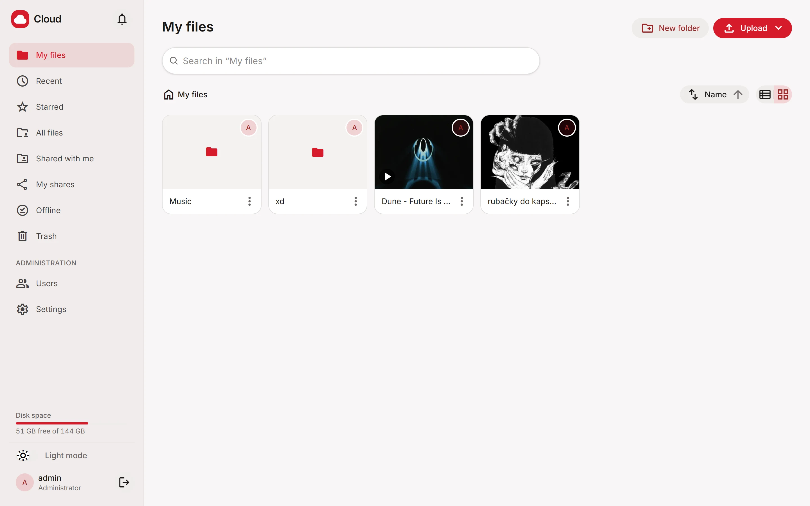
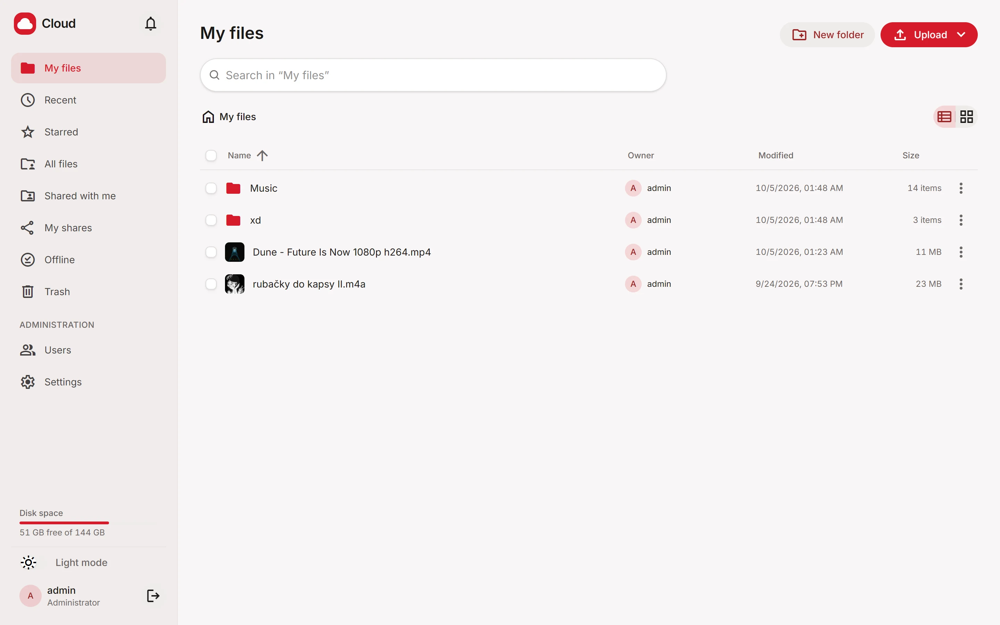
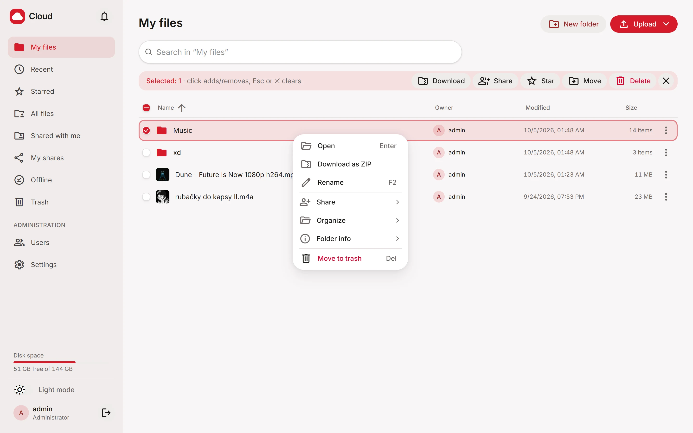
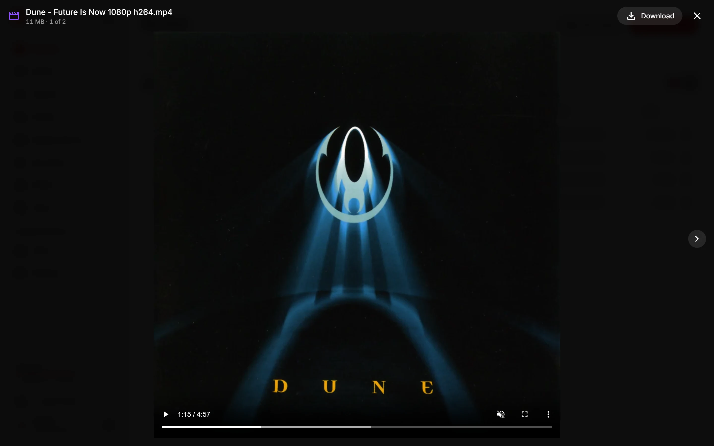
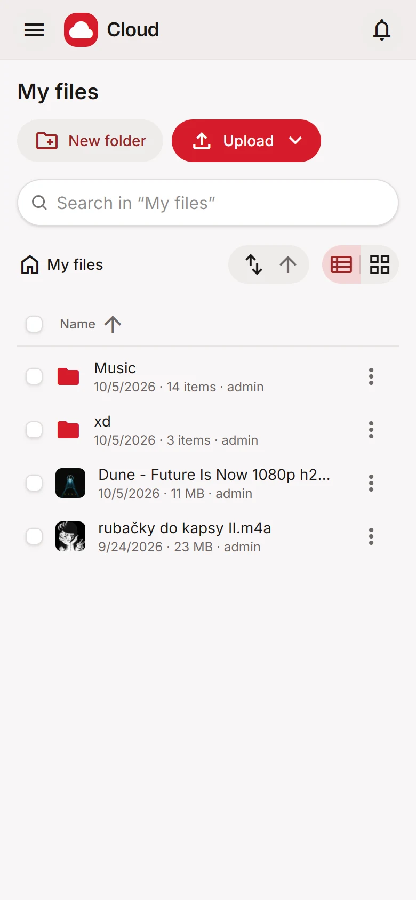
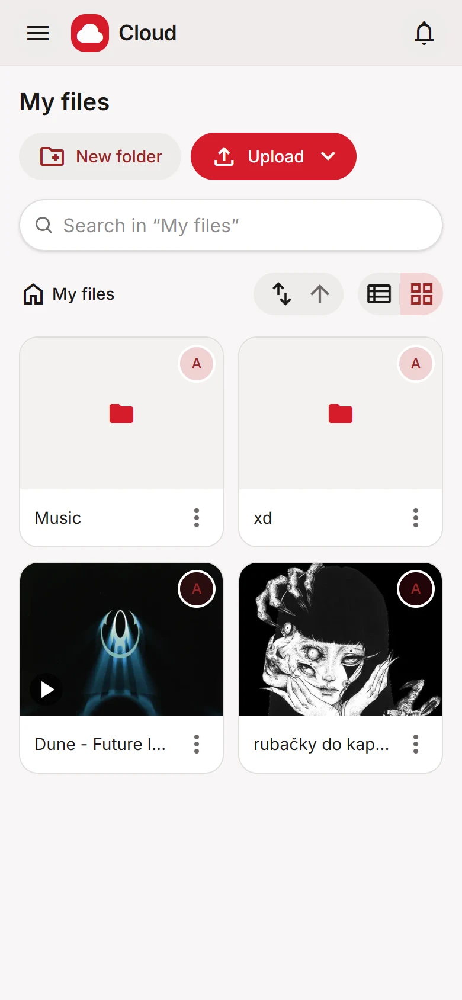
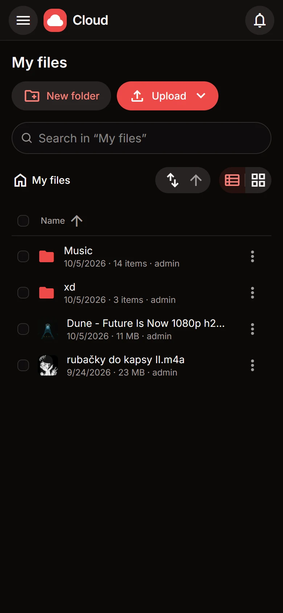
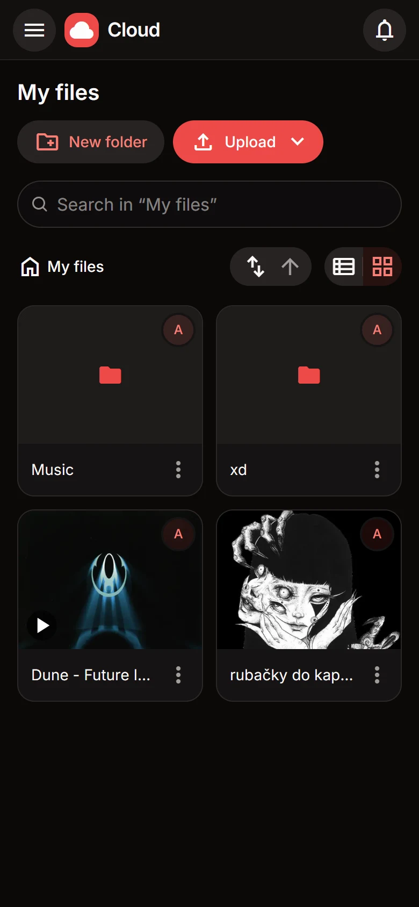

<div align="center">

# ☁️ Cloud

**Your own Google Drive. On your server, on your disks, with no subscription.**

A self-hosted file manager for your home server: fast, good-looking and ready for the whole family.
One Docker container, one command to install.

🇨🇿 [O projektu česky](README.cs.md)


<picture>
  <source media="(prefers-color-scheme: dark)" srcset="docs/screenshots/en/desktop-grid-dark.webp">
  
</picture>

</div>

---

## Why Cloud?

- **Your data stays at home.** No third-party company, no plan limits, nobody scanning your photos.
- **Files are just files.** They live on disk as `<folder>/<user>/…`, in no proprietary format. Copy them, back them up or open them without the app, any time.
- **It looks and works like the services you already know.** A Google Drive–style context menu, previews, drag and drop, sharing.
- **Installed in minutes.** `sudo ./setup.sh` asks a few questions and does the rest; updating is a single command.

## ✨ Features

**Files**
- List and grid views with thumbnails; sort by name, date or size (folders show how many items they contain)
- Drag-and-drop upload of files and whole folders (several at once), with progress
- Drag items into folders to move them; copy, rename, create folders
- Download a folder or a selection as a ZIP (streamed, even for huge folders)
- Select with a click, Ctrl/Shift-click or by dragging across checkboxes; double-click opens
- Context menu with submenus (Share / Organize / Info) and keyboard shortcuts
- Instant filter in the current folder, plus search through subfolders (Enter)
- Trash: deleted files can be restored for 30 days

**Previews**
- Photos, video (with seeking), music, PDFs and text files right in the browser
- Photo thumbnails, video frames and album covers (ffmpeg), cached so the grid loads instantly even on mobile data

**Organizing**
- Folder colors, stars and a *Starred* view
- *Recent* view: what you opened or uploaded last
- Details for files and folders (size, item count, owner, dates)

**Sharing**
- Share with other users, each one either *can view* or *can edit*
- In-app notifications (the bell) when someone shares something with you
- Public links with optional expiry, for people without an account, with previews
- *My shares* overview: who has what, revoke with one click

**Users and administration**
- Accounts with a profile: first name, last name and avatar (you see the owner of every item)
- Everyone sees only their own files; admins can browse everything
- Per-user quotas with a storage meter
- Admin panel: users, password resets, the cloud's root folder, the default language

**Everywhere**
- Light and dark mode, fully responsive: on a phone it feels like an app
- Installable as an app (PWA), with files available offline
- English and Czech: picked automatically from the browser, and everyone can change it in Account

## 📸 Screenshots

<table>
  <tr>
    <td width="50%">
      <picture>
        <source media="(prefers-color-scheme: dark)" srcset="docs/screenshots/en/desktop-list-dark.webp">
        
      </picture>
      <p align="center"><sub>List with owners, dates and item counts</sub></p>
    </td>
    <td width="50%">
      <picture>
        <source media="(prefers-color-scheme: dark)" srcset="docs/screenshots/en/desktop-menu-dark.webp">
        
      </picture>
      <p align="center"><sub>Context menu and selection bar</sub></p>
    </td>
  </tr>
  <tr>
    <td colspan="2">
      
      <p align="center"><sub>Preview video, photos, music, PDFs and text right in the browser</sub></p>
    </td>
  </tr>
</table>

<p align="center">
  
  
  
  
</p>

## 🚀 Installation (Ubuntu server)

You need Ubuntu (22.04 or newer), `sudo` access and git. The script installs Docker for you.

```bash
sudo git clone https://github.com/honzacies/file-manager.git /opt/cloud
cd /opt/cloud
sudo ./setup.sh
```

The script asks for:

1. **the folder for files**, for example a big data disk (`/mnt/data/cloud`),
2. **the port** (default `8080`),
3. **the address** the web app listens on (`0.0.0.0` = your whole home network),
4. **the Linux user** who will own the files,
5. **the admin's username and password**.

Then it builds and starts the container and prints the address, e.g. `http://192.168.1.10:8080`. That's it: sign in and create accounts for everyone else under *Administration → Users*.

### Updating

```bash
cd /opt/cloud && sudo ./update.sh
```

Pulls the latest version from GitHub and rebuilds the container without asking anything. Your settings and data stay where they are. If there's nothing new, it does nothing (`--force` rebuilds anyway).

### Access from outside (recommended: Tailscale)

The safest way to reach your cloud away from home is [Tailscale](https://tailscale.com): your server isn't exposed to the internet and you get HTTPS for free:

```bash
curl -fsSL https://tailscale.com/install.sh | sh
sudo tailscale up
sudo tailscale serve --bg 8080
```

The cloud is then available at `https://<server-name>.<your-tailnet>.ts.net`. HTTPS is also required for offline files and installing it as an app.

### Forgot the admin password

```bash
cd /opt/cloud && sudo ./setup.sh
```

…and answer `y` to *"Create another admin or reset an existing password?"*.

### Handy commands

| What | Command |
| --- | --- |
| Logs | `docker compose logs -f cloud` |
| Restart | `docker compose restart cloud` |
| Database backup | copy the `/opt/cloud/data` folder |

User files live in the folder you chose during installation; the database (accounts, shares, settings) lives in `/opt/cloud/data`. Those two folders are all you need for a complete backup.

## 🛡️ Security

Cloud is built so that nobody gets to files they shouldn't, and that's verified automatically: `npm run verify` runs **34 attack and functional tests** against a real server instance (escaping your own folder, other people's files, escalating to admin, XSS via uploaded files, spoofed headers…).

- **Passwords** are hashed with **Argon2id** (the recommended standard), and sign-in is rate-limited against guessing.
- **Sessions** use a random token in an `httpOnly` + `SameSite=Strict` cookie: JavaScript can't read it and other sites can't use it. The database stores only its SHA-256 hash, so even a leaked database doesn't give access to accounts.
- **User isolation:** every path is normalized on the server and locked inside the user's folder (`../` leads nowhere). Someone else's file or share returns 404, not "access denied", so it doesn't even reveal that it exists.
- **Sharing** is checked on every request against the signed-in user; *can view* means read-only at the API level too.
- **Uploaded files never run:** HTML and SVG are served as plain text or under `CSP: sandbox`, with `X-Content-Type-Options: nosniff`. Avatars are accepted only as verified WebP.
- **Sensitive actions** (resetting someone's password, deleting an account) require the admin's own password, so a stolen session isn't enough.
- **The database is out of reach:** the cloud's root folder can't contain the data folder, so it can't be downloaded through the app.
- **Public links** are long random tokens with optional expiry and their own rate limit.
- **Proxy headers** (`X-Forwarded-For`) are trusted only from localhost and the Docker network, so nobody on the LAN can spoof an IP to dodge limits.
- **The container** runs as an unprivileged user, not root. Few dependencies, and `npm audit` comes back clean.

**Running it safely:** don't expose the port directly to the internet with port forwarding on your router. Use Tailscale or another VPN / reverse proxy with HTTPS. Don't put symlinks pointing outside the cloud folder into it.

Found a vulnerability? Please report it privately via **Security → Report a vulnerability** on GitHub rather than in a public issue.

## 🧑‍💻 Development

**You need:** Node.js **24+** (TypeScript runs directly, no build step) and optionally `ffmpeg` for thumbnails.

```bash
git clone https://github.com/honzacies/file-manager.git
cd file-manager

# API at http://localhost:8080, data in Api/data and files in Api/cloud
cd Api && npm install && npm run dev

# Web (second terminal) at http://localhost:3000, /api is proxied to the API
cd Web && npm install && npm run dev

# First account (the password is read from stdin)
cd Api && npm run create-admin -- admin
```

### Architecture

```
┌─────────────── Docker container ───────────────┐
│  Fastify API  ──►  SQLite (accounts, shares…)  │
│      │                                         │
│      ├──►  files on disk  <root>/<user>/…      │
│      ├──►  ffmpeg  →  thumbnail cache          │
│      └──►  static export of the Next.js app    │
└────────────────────────────────────────────────┘
```

| Folder | What's inside |
| --- | --- |
| `Api/` | Fastify 5, built-in `node:sqlite`, Argon2id (`hash-wasm`), TypeScript run directly by Node |
| `Web/` | Next.js 16 (`output: "export"`), React 19, Tailwind CSS v4, HeroUI v3, a service worker for offline |
| `setup.sh` / `update.sh` | installation and updates on Ubuntu |
| `Dockerfile` | two-stage build: web → static files, served by the API |

The web app and the API share one origin: no CORS, no reverse proxy inside. In production the API serves the static export; in development `next dev` proxies `/api` to the API (`API_URL`).

Texts live right where they're used, `t("Files", "Soubory")` in the web app and `T("…", "…")` in the API, so there are no dictionaries to drift out of sync with the code.

### Checks

```bash
cd Api && npm run verify                      # 34 security and functional tests
cd Web && npm run typecheck
cd Web && npm run build                       # static export to Web/out
cd Web && node src/lib/safeRedirect.check.ts  # the post-login redirect never leaves the app
cd Web && node src/lib/dropFiles.check.ts     # dropping several folders at once
cd Web && node src/lib/i18n.check.ts          # language order: user → browser → default
```

### API configuration (environment variables)

| Variable | Default | Meaning |
| --- | --- | --- |
| `PORT` | `8080` | API port |
| `LISTEN_HOST` | `127.0.0.1` | listen address (`0.0.0.0` in Docker) |
| `DATA_DIR` | `./data` | SQLite database, avatars, thumbnail cache |
| `DEFAULT_ROOT_DIR` | `./cloud` | default root for files (the admin can change it) |
| `WEB_DIR` | — | static export of the web app; without it only the API runs |
| `FFMPEG_PATH` | `ffmpeg` | path to ffmpeg |

## Not there yet

File versions, a desktop sync client and push notifications while the browser is closed. Pull requests welcome.

## License

[MIT](LICENSE) © Honza Cieslar
